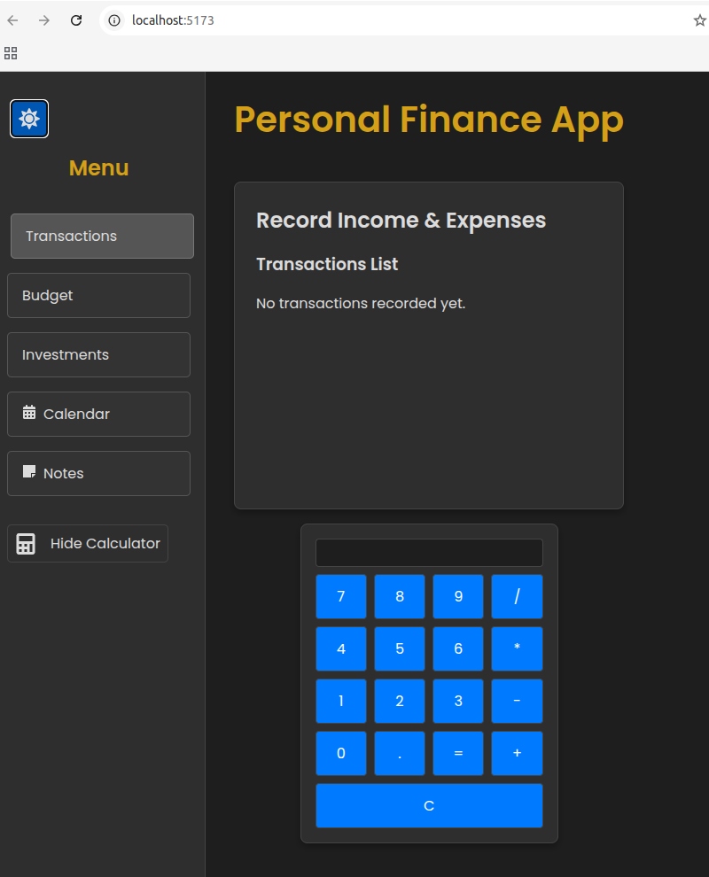

# FinanceApp



## Overview

FinanceApp is a personal finance application designed to help you manage your transactions, budgets, investments, and more—all in one place. The application features a modern, responsive interface with a dark/light theme toggle, an integrated calculator, a calendar for scheduling, and a note-taking module.

## Features

- **Transaction Tracking:** Manage your expenses and income with ease.
- **Budget Planning:** Create and monitor budgets for various categories.
- **Investment Management:** Keep track of your investments and financial goals.
- **Built-in Calculator:** Quickly perform arithmetic calculations.
- **Calendar:** Plan and schedule important financial events.
- **Notes:** Take and manage personal finance-related notes.
- **Dark/Light Theme Toggle:** Easily switch between dark and light themes for comfortable viewing.

## Technologies

- **Frontend:**
    - React with TypeScript
    - Vite for development and build
    - React Icons for intuitive iconography
    - React Calendar for calendar functionality
- **Backend:**
    - Spring Boot with Spring Security
    - Spring Session JDBC for session management
    - PostgreSQL as the database
- **Styling:**
    - Custom CSS with CSS variables for theme management

## Getting Started

## API Enpoints

`API Endpoints
Transactions Endpoints
GET /api/transactions: Retrieves all transactions.

GET /api/transactions/{id}: Retrieves a specific transaction by its ID.

GET /api/transactions/recurring: Retrieves all recurring transactions.

POST /api/transactions: Creates a new transaction with details such as amount, date, description, category (via an ID), tags, and a recurring flag.

PUT /api/transactions/{id}: Updates an existing transaction.

DELETE /api/transactions/{id}: Deletes a transaction.

Categories Endpoints
GET /api/categories: Retrieves all categories.

GET /api/categories/{id}: Retrieves a specific category by its ID.

GET /api/categories/type/{type}: Retrieves categories filtered by type (INCOME or EXPENSE).

POST /api/categories: Creates a new category with attributes such as name and type.

PUT /api/categories/{id}: Updates an existing category.

DELETE /api/categories/{id}: Deletes a category.

Budgets Endpoints
GET /api/budgets: Retrieves all budgets with their associated category data.

GET /api/budgets/{id}: Retrieves a specific budget by its ID.

POST /api/budgets: Creates a new budget for a specified category and month with an allocated amount. This endpoint ensures that each category-month combination is unique.

PUT /api/budgets/{id}: Updates an existing budget.

DELETE /api/budgets/{id}: Deletes a budget.

Investments Endpoints
GET /api/investments: Retrieves all investments.

GET /api/investments/{id}: Retrieves a specific investment by its ID.

POST /api/investments: Creates a new investment entry with details such as name, amount, and type.

PUT /api/investments/{id}: Updates an existing investment.

DELETE /api/investments/{id}: Deletes an investment.`

### Prerequisites

- [Node.js](https://nodejs.org/) (v14 or later)
- [Java](https://www.oracle.com/java/technologies/javase-downloads.html) (JDK 11 or later)
- [PostgreSQL](https://www.postgresql.org/)

### Installation

1. **Clone the Repository:**

   ```bash
   git clone https://github.com/PatrickJamesRepo/FinanceTracker
   cd FinanceApp
